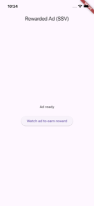

# Rewarded Ads (SSV) Sample

Minimal example of granting a RevenueCat reward from a rewarded ad using
server-side verification (SSV), via the two reward-verification primitives:

1. `Purchases.generateRewardVerificationToken(impressionId)` → a `RewardVerificationToken`
2. forward `token.customData` + `token.appUserID` to the ad network's SSV options
3. show the ad with `google_mobile_ads`
4. `Purchases.pollRewardVerification(token.clientTransactionId)` → the verified reward

The whole flow lives in [`lib/main.dart`](lib/main.dart):

```dart
// 1. Use the loaded ad's response ID as the impression ID, then generate a
//    verification token for it.
final token = await Purchases.generateRewardVerificationToken(
  ad.responseInfo?.responseId ?? '',
);

// 2. Wire RevenueCat verification into AdMob's server-side verification.
await ad.setServerSideOptions(ServerSideVerificationOptions(
  userId: token.appUserID,
  customData: token.customData,
));

// 3. Show the ad, then poll for the verified reward once it's watched.
await ad.show(onUserEarnedReward: (ad, _) async {
  final result = await Purchases.pollRewardVerification(
    token.clientTransactionId,
  );
});
```



## Run (smoke test — no reward)

```sh
flutter pub get
flutter run
```

Set your RevenueCat API keys (`_appleApiKey` / `_googleApiKey`) in `lib/main.dart`
first — a Test Store key is fine. Tap **Load ad**, then **Watch ad to earn
reward** once it's ready — nothing loads automatically, so there's no async
load racing an in-flight verification poll.

Out of the box it uses **Google's public test rewarded-interstitial ad unit**, so
the ad always fills and the full bridge runs, but `pollRewardVerification` returns
`failed` — there's no reward configured behind a test ad unit. This confirms the
wiring (token → SSV options → show → poll) end to end.

## Test a real grant

For `pollRewardVerification` to return a verified reward, the ad network's SSV
callback must reach RevenueCat and RevenueCat must have a reward configured. You
need all of:

1. **An AdMob ad unit with SSV pointed at RevenueCat.** Create a rewarded (or
   rewarded-interstitial) unit in AdMob and set its **Server-side verification
   URL** to RevenueCat's SSV endpoint. Put that unit in `_iosAdUnitId` /
   `_androidAdUnitId`, and your AdMob **app id** in `ios/Runner/Info.plist`
   (`GADApplicationIdentifier`) and `android/app/src/main/AndroidManifest.xml`
   (`com.google.android.gms.ads.APPLICATION_ID`).
2. **A reward rule in the RevenueCat dashboard** for that app + ad unit — a
   virtual currency or an entitlement. Without it, verification returns
   `no_reward` / `failed`.
3. **A real RevenueCat API key** in `_appleApiKey` / `_googleApiKey` for the app
   that owns the rule.
4. **Run on a device/emulator and watch the ad.** AdMob serves a test ad on
   simulators/emulators (they're registered test devices), fires the SSV callback
   to RevenueCat with your `customData`, RevenueCat verifies + grants, and
   `pollRewardVerification` returns the reward. An entitlement reward also shows
   up in `CustomerInfo`.

